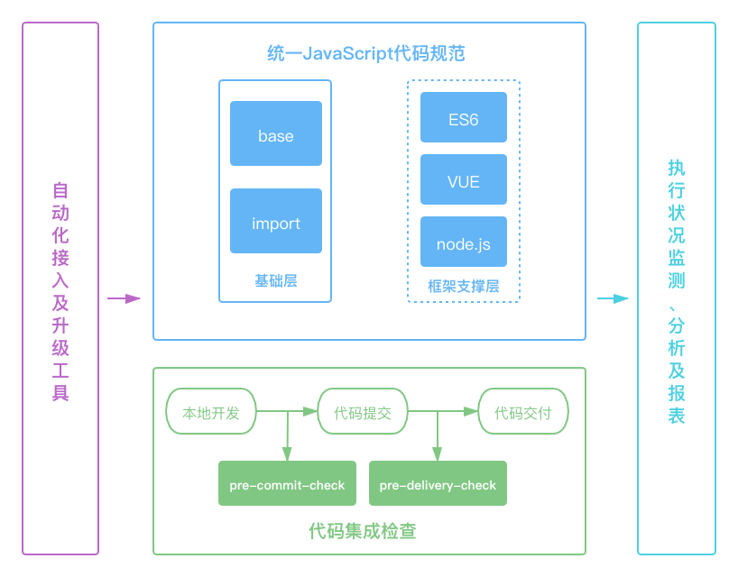
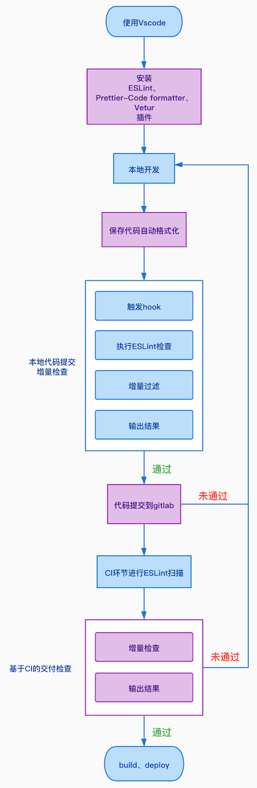

# 架构

## 概览

上图展示了ESLint在配置、校验、部署等整个开发链路中的简要架构：
* 使用统一的编辑器，插件配置，ESLint规则。
* 保存时编辑器自动格式化代码，确保一致性的代码风格。
* 提交代码时，pre-commit钩子函数会触发代码的校验，确保提交的代码符合ESLint规则，而且提交类型说明必须符合规范，方可正常提交。
* 代码在gitlab上集成时，CI文件会优先执行ESLint扫描，扫描通过后，才执行build和deploy。
* 执行状况监测、分析及报表功能，待规划。

## 核心流程

