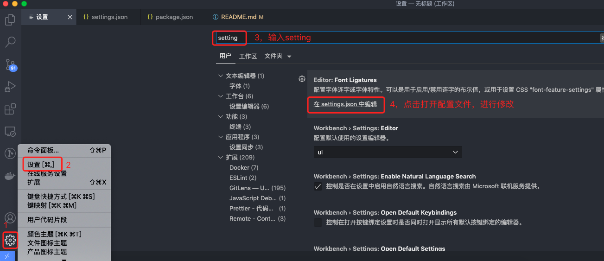

# 教程

## 说明

###### 此教程为

基于 ESLint 扫描校验的研发工具链配置，详细流程见 [流程核心](/web/guide/architecture.md)

###### 关于工具

ESLint：校验代码格式，校验代码质量。

Prettier：校验代码格式（并格式化代码）。

代码格式：单行代码长度、tab 长度、空格、逗号表达式等。

代码质量：未使用变量、三等号、全局变量声明等。

## 环境

依赖环境

> 环境：macOS  
> Node：v6+  
> 编辑器：Vscode  
> 编辑器插件：ESLint、Prettier

## 配置

此配置流程是基于 `web-cli` 脚手架进行实现的。脚手架原先已集成部分 eslint 部分配置，故以下配置约定你已安装 eslint 相关依赖包。

以下步骤，默认你当前环境已符合上面的`依赖环境`要求。

### 步骤 1： 配置 Vscode

1、 `settings.json` 配置，打开 Vscode，然后按下图方式打开配置文件



2、配置内容如下，请注意，如果你原来的配置信息与此配置相冲突，请务必以此配置为准。

```json
{
  "workbench.colorTheme": "One Monokai", //编辑器主题（推荐）
  "editor.fontSize": 12,
  "editor.codeActionsOnSave": {
    //是否在保存的时候自动fix eslint
    "source.fixAll.eslint": true
  },
  "editor.formatOnSave": true, // #默认的format，每次保存的时候自动格式化
  "eslint.options": {
    //指定vscode的eslint所处理的文件的后缀
    "extensions": [".js", ".vue", ".ts", ".tsx"]
  },
  "eslint.validate": [
    //确定校验准则
    "vue",
    "javascript",
    "html",
    "typescript"
  ],
  "files.autoSave": "off",
  "files.associations": {
    "*.wpy": "vue",
    "*.wxml": "wxml",
    "*.cjson": "jsonc",
    "*.wxss": "css",
    "*.wxs": "javascript",
    "*.html": "html"
  },
  "emmet.includeLanguages": {
    "vue-html": "html"
  },
  "minapp-vscode.disableAutoConfig": true,
  // vscode默认启用了根据文件类型自动设置tabsize的选项
  "editor.detectIndentation": false,
  // 重新设定tabsize
  "editor.tabSize": 4,
  //  #让prettier使用eslint的代码格式进行校验
  "prettier.eslintIntegration": true,
  //  #去掉代码结尾的分号
  "prettier.semi": false,
  //  #使用单引号替代双引号
  "prettier.singleQuote": true,
  //  #让函数(名)和后面的括号之间加个空格
  "javascript.format.insertSpaceBeforeFunctionParenthesis": true,
  // #让vue中的js按编辑器自带的ts格式进行格式化
  "vetur.format.defaultFormatter.js": "vscode-typescript",
  "git.enableSmartCommit": true,
  "editor.quickSuggestions": {
    "strings": true
  },
  "workbench.colorCustomizations": {
    // 选中颜色
    "editor.selectionBackground": "#2170FF"
  },
  //一定要在vutur.defaultFormatterOptions参数中设置，单独修改prettier扩展的设置是无法解决这个问题的，因为perttier默认忽略了vue文件（事实上从忽略列表移除vue也不能解决这个问题）
  "vetur.format.defaultFormatterOptions": {
    "js-beautify-html": {
      // force-aligned | force-expand-multiline
      "wrap_attributes": "force-aligned"
    },
    "prettyhtml": {
      "printWidth": 100,
      "singleQuote": false,
      "wrapAttributes": false,
      "sortAttributes": true
    },
    "prettier": {
      //  #去掉代码结尾的分号
      "semi": false,
      //  #使用单引号替代双引号
      "singleQuote": true
    }
  },
  "[vue]": {
    "editor.defaultFormatter": "esbenp.prettier-vscode"
  },
  "[html]": {
    "editor.defaultFormatter": "esbenp.prettier-vscode"
  },
  "[less]": {
    "editor.defaultFormatter": "esbenp.prettier-vscode"
  },
  "[json]": {
    "editor.defaultFormatter": "esbenp.prettier-vscode"
  }
}
```

### 步骤 2：配置 husky

1、在项目根目录创建 `.husky` 文件夹。

2、在项目根目录执行 `npx husky-init && npm install` 命令。

`package.json` 文件会自动安装 `husky` 依赖和新增 `prepare`

```json
"scripts": {
    "prepare": "husky install"
},
"devDependencies": {
    "husky": "^7.0.0" // 注意，安装的版本不应低于7.0.0，因为低版本的配置方式不同
},
```

3、在项目根目录执行 `npx husky add .husky/commit-msg 'npx --no-install commitlint --edit "$1"'` 命令，生成 commit-msg 文件。

4、修改 commit-msg 和 pre-commit 文件配置，如下

`commit-msg` 文件配置

```bash
#!/bin/sh
. "$(dirname "$0")/_/husky.sh"

PATH=$PATH:/usr/local/bin:/usr/local/sbin

npx --no-install commitlint --edit "$1"
```

`pre-commit` 文件配置

```bash
#!/bin/sh
. "$(dirname "$0")/_/husky.sh"

PATH=$PATH:/usr/local/bin:/usr/local/sbin

echo "eslint格式校验"

npx lint-staged
```

### 步骤 3：配置 lint-staged

1、在项目根目录执行 `npm install --save-dev lint-staged` 命令，安装 lint-staged 依赖。

2、在 `package.json` 中加入如下配置

```json
{
  "scripts": {
    "precommit": "lint-staged"
  },
  "lint-staged": {
    "*.{js,vue}": "eslint --cache --fix",
    "*.{js,css,md}": "prettier --write"
  }
}
```

### 步骤 4：配置 commitlint

1、在项目根目录执行 `npm install --save-dev @commitlint/cli @commitlint/config-conventional` 命令，安装 commitlint 依赖。

2、在项目根目录创建 `commitlint.config.js` 文件，并配置如下

```js
module.exports = {
  extends: ['@commitlint/config-conventional'],
  parserPreset: {
    parserOpts: {
      headerPattern: /^(\w*)(?:\((.*)\))?:\s(.*)$/,
      headerCorrespondence: ['type', 'scope', 'subject'],
    },
  },
  rules: {
    'type-enum': [
      2,
      'always',
      [
        'feat', // 新功能（feature）
        'fix', // 修补bug
        'docs', // 文档（documentation）
        'style', // 格式（不影响代码运行的变动）
        'refactor', // 重构（即不是新增功能，也不是修改bug的代码变动）
        'test', // 增加测试
        'revert', // 回滚
        'chore', // 构建过程或辅助工具的变动
        'perf', // 性能优化
      ],
    ],
    'type-empty': [2, 'never'], // 提交不符合规范时,也可以提交,但是会有警告
    'subject-empty': [2, 'never'], // 提交不符合规范时,也可以提交,但是会有警告
    'subject-full-stop': [0, 'never'],
    'subject-case': [0, 'never'],
  },
}
```

### 步骤 5：配置 prettier

1、在项目根目录执行 `npm install --save-dev prettier` 命令，安装 prettier 依赖。

2、在项目根目录创建 `.prettierrc`文件，并配置如下

```json
{
  "printWidth": 160,
  "tabWidth": 4,
  "semi": true,
  "singleQuote": true,
  "trailingComma": "all",
  "endOfLine": "lf"
}
```

> 编辑器会优先使用此配置文件里的格式化配置信息

### 步骤 6：配置 ESLint

1、由于 `web-cli` 脚手架项目 `package.json` 已经集成 `eslint` 和 `eslint-loader` 依赖包及其配置，故无需重复安装。

2、在项目根目录创建 `.eslintrc.js` 文件，并配置如下

```js
// https://eslint.org/docs/user-guide/configuring

module.exports = {
  root: true,
  parserOptions: {
    parser: 'babel-eslint',
    sourceType: 'module',
  },
  env: {
    browser: true,
    node: true,
    // node: true
  },
  // https://github.com/vuejs/eslint-plugin-vue#priority-a-essential-error-prevention
  // consider switching to `plugin:vue/strongly-recommended` or `plugin:vue/recommended` for stricter rules.
  extends: ['plugin:vue/essential', 'airbnb-base'],
  // extends: 'standard',
  // required to lint *.vue files
  plugins: [
    'vue',
    // standard风格的依赖包
    'standard',
    // standard风格的依赖包
    'promise',
    // 'prettier',
  ],
  // check if imports actually resolve
  settings: {
    'import/resolver': {
      webpack: {
        config: 'build/webpack.base.conf.js',
      },
    },
  },
  // add your custom rules here
  rules: {
    // "prettier/prettier": "error",
    // don't require .vue extension when importing
    'import/extensions': [
      'error',
      'always',
      {
        js: 'never',
        vue: 'never',
      },
    ],
    // disallow reassignment of function parameters
    // disallow parameter object manipulation except for specific exclusions
    'no-param-reassign': [
      'error',
      {
        props: true,
        ignorePropertyModificationsFor: [
          'state', // for vuex state
          'acc', // for reduce accumulators
          'e', // for e.returnvalue
        ],
      },
    ],
    // allow optionalDependencies
    'import/no-extraneous-dependencies': [
      'error',
      {
        optionalDependencies: ['test/unit/index.js'],
      },
    ],
    // allow paren-less arrow functions
    'arrow-parens': 0,
    // allow async-await
    'generator-star-spacing': 0,
    // allow debugger during development
    'no-debugger': process.env.NODE_ENV === 'production' ? 'error' : 'off',

    // indentation off
    // indent: ['off', 4],
    indent: [2, 4],

    // allow no unused vars
    'no-unused-vars': 'off',
    // allow exceeds the maximum line length of 80
    'max-len': 'off',
    // 'max-len': ["error", { "code": 5000 }],
    // allow for loop afterthoughts
    'no-plusplus': ['error', { allowForLoopAfterthoughts: true }],
    // allow shadow variables
    'no-shadow': 'off',
    // 'no-multiple-empty-lines': [2, { 'max': 1}],//空行最多不能超过1行
    'linebreak-style': ['off', 'windows'],
  },
  globals: {
    TTJSBridge: true,
    myWebview: true,
  },
}
```

> 注意：
>
> 1、如果原有代码中存在较多不符合团队 eslint 规则的写法，则可修改此配置信息。
>
> 2、文件存在较多不符合团队 eslint 规则的写法，修改代码会影响业务流程，可考虑在文件顶部加上 `/* eslint-disable */` ，禁用 eslint 扫描此文件。
>
> 3、原则上对于不符合团队 eslint 规则的代码，优先修改代码，以确保代码符合规范。
>
> 4、对于新项目，或者新写的代码，必须经过 eslint 扫描，禁止关掉 eslint。

### 步骤 7：配置 CI 扫描环节

1、打开 `.gitlab-ci.yml` 文件，并配置如下

```yml
image: //镜像地址
stages:
  - eslint # 在 build 环节之前，增加 eslint 环节。
  - build
  - deploy
  - cdn

#变量
variables:
  # 以下忽略

#script执行前，设置SSH
before_script:
  # 以下忽略

# eslint ，在 build 环节之前，增加 eslint 环节
eslint:
  stage: eslint
  script:
    # 拉取node_modules缓存
    - ls |grep "node_modules" || { npm install --registry=http://npm.taobao.org/; };
    # 执行eslint校验命令
    - npm run lint
  only:
    - master
    - release
    - dev
  tags:
    - gitlab

# 构建
build:
  stage: build
  # 以下忽略
```
